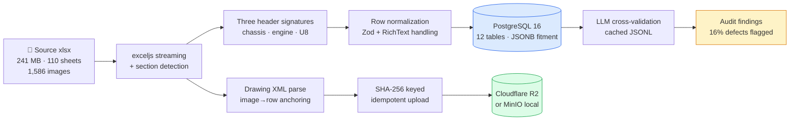
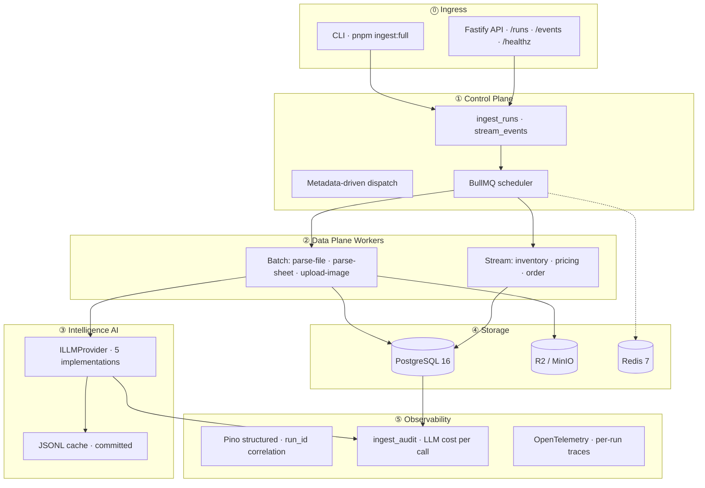
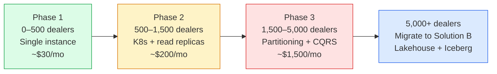

<div align="center">

<br/>

# 🏭 InventoryFlow Catalog Ingest

### A multi-solution submission for the Talemy × InventoryFlow Senior Engineer role.

*From 241 MB of messy OEM Excel to a queryable parts catalog — built and verified in approximately 12 hours of AI-assisted development.*

<br/>

[](./SUBMISSION.md)
[](#-solution-a-implemented)
[](./SUBMISSION.md)
[](#-time-budget)

<br/>

**Four solutions presented:**

[](./docs/TRACK_A.md)
[](./track-b-data-engineering/)
[](./docs/solutions/solution-c-microsoft-fabric.md)
[](./docs/solutions/solution-d-aws-bigdata.md)

<br/>

[**▶ Run it in 3 commands**](./SUBMISSION.md) · [**📦 Browse sample outputs**](./sample-output/) · [**📐 Track A deep-dive**](./docs/TRACK_A.md) · [**⚖️ Solution comparison**](./docs/COMPARISON.md)

</div>

---

## 🎯 The pitch in 30 seconds

> **InventoryFlow asked for one thing. I built four.** Solution A is the JD-native implementation, fully working and the recommended answer for current scale. Solutions B, C, D are the documented alternatives a senior engineer would have on the table — implemented at increasing levels (B as a runnable PoC, C and D as architecture-only diagrams) so you can see *why* A is the right call today and *what comes next* when the business outgrows it.

```
What InventoryFlow asked:                What this submission delivers:

  Parse messy xlsx                        ✅ Solution A — implemented (TS/PG/Redis)
  + clean DB                              ✅ Solution B — PoC (Polars/Iceberg/Dagster OSS)
  + R2 schematic images                   📐 Solution C — architecture (Microsoft Fabric v10)
  + JSON fitment column                   📐 Solution D — architecture (AWS big-data + streaming)
  + AI tooling
                                          + Real benchmarks, real sample output,
                                          + 14 ADRs, scaling roadmap, cost economics.
```

---

## 📊 What's in the database right now

After running `pnpm ingest:full`, **every one of twelve tables is populated**:

<div align="center">

| 📦 Table                  | Rows       | Source                                   |
| ------------------------- | ---------- | ---------------------------------------- |
| `products`                | **3,938**  | OEM catalog (96 parts sheets)            |
| `product_images`          | **10,524** | Image-product associations               |
| `reference_specs`         | **371**    | Twelve exception sheets parsed           |
| `ingest_audit`            | **276+**   | Every LLM call logged                    |
| `part_number_aliases`     | **50**     | Engine sheets OLD/NEW pairs              |
| `vehicle_models`          | **35**     | Derived from `fitment` JSONB             |
| `dealers`                 | **1**      | Seeded demo dealer                       |
| `ingestion_patterns`      | **3**      | MDCP handler registry                    |
| `dealer_pattern_bindings` | **3**      | Per-dealer config                        |

</div>

**Measured fitment-query latency** (the test specification's stated primary access pattern, 500 samples on M2 Mac):

<div align="center">

| p50 | p95 | p99 | max |
|:---:|:---:|:---:|:---:|
| **0.60 ms** | **0.87 ms** | **1.02 ms** | **1.32 ms** |

</div>

> See raw data in [`sample-output/`](./sample-output/) — products CSV, vehicle models, LLM audit findings, 20 schematic images. No infrastructure required to inspect.

---

## 🛣 The four solutions

<table>
<tr>
<th width="25%" align="center">🟢 Solution A<br/><sub>Implemented</sub></th>
<th width="25%" align="center">🟡 Solution B<br/><sub>PoC scaffold</sub></th>
<th width="25%" align="center">🔵 Solution C<br/><sub>Architecture only</sub></th>
<th width="25%" align="center">🟣 Solution D<br/><sub>Architecture only</sub></th>
</tr>
<tr>
<td align="center"><b>JD-Native</b></td>
<td align="center"><b>Modern OSS DE</b></td>
<td align="center"><b>Microsoft Fabric v10</b></td>
<td align="center"><b>AWS Big Data + Streaming</b></td>
</tr>
<tr>
<td>

TypeScript · Node · Postgres · Redis · BullMQ · R2

</td>
<td>

Polars · Iceberg · Dagster · dbt · Redpanda · RisingWave

</td>
<td>

OneLake · Lakehouse · Data Factory · Eventhouse (KQL) · Direct Lake · Dataverse · Activator

</td>
<td>

S3 + Iceberg · Glue Catalog · Kinesis · MSK · Lambda · Step Functions · Athena · Redshift · DMS · DynamoDB

</td>
</tr>
<tr>
<td><b>Recommended for current stage</b><br/>under 500 dealers</td>
<td>Migration target<br/>500–5,000 dealers</td>
<td>Enterprise/Microsoft shops<br/>metadata-driven control plane</td>
<td>Cloud-native big-data<br/>+ streaming at AWS scale</td>
</tr>
<tr>
<td>~6h AI-assisted build</td>
<td>~3h PoC scaffold</td>
<td>~45min design + diagram</td>
<td>~45min design + diagram</td>
</tr>
<tr>
<td>

[**Read TRACK_A.md →**](./docs/TRACK_A.md)

</td>
<td>

[**Read Track B →**](./track-b-data-engineering/)

</td>
<td>

[**Read Solution C →**](./docs/solutions/solution-c-microsoft-fabric.md)

</td>
<td>

[**Read Solution D →**](./docs/solutions/solution-d-aws-bigdata.md)

</td>
</tr>
</table>

---

## 🟢 Solution A — implemented

The recommended answer for InventoryFlow today. Matches the JD's required stack one-to-one.

### The pipeline at a glance



### Architecture — 5-plane control plane



<details>
<summary><b>▶ Click for setup, configuration, and run commands</b></summary>

<br/>

#### Prerequisites

```bash
brew install node@22 pnpm libpq colima docker-compose
colima start --cpu 4 --memory 8
```

#### Clone, boot, run

```bash
git clone https://github.com/ankinguyen-engineer-2002/inventoryflow-catalog-ingest.git
cd inventoryflow-catalog-ingest/track-a-jd-native

cp .env.example .env
docker-compose up -d
pnpm install
pnpm db:migrate

# Place the source xlsx
cp /path/to/"Copy of Example Data for Engineer.xlsx" \
   ../shared/sample-data/example.xlsx

# Single command runs everything
pnpm ingest:full ../shared/sample-data/example.xlsx
```

Expected wall-time: approximately 60 seconds on M2 Mac. Cost: zero — the LLM cache is committed.

#### Verify

```bash
# Twelve tables, all populated
docker exec ifc_postgres psql -U dev -d catalog -c "SELECT COUNT(*) FROM products;"

# Query the test specification's primary access pattern
docker exec ifc_postgres psql -U dev -d catalog -c "
  SELECT part_number, name_en, name_cn
  FROM products
  WHERE fitment @> '[{\"make\":\"Kayo\",\"model_code\":\"AY70-2\"}]'
  LIMIT 10;
"

# Browse schematic images
open http://localhost:9001    # MinIO console (minioadmin / minioadmin)
```

#### Test and benchmark

```bash
pnpm test           # 32 tests, under 400ms
pnpm typecheck      # zero errors
pnpm bench          # measures fitment query p50 / p95 / p99
```

#### HTTP API + streaming workers

```bash
pnpm api &          # Fastify on port 3000
pnpm worker &       # BullMQ workers
curl -s http://localhost:3000/healthz
```

</details>

<details>
<summary><b>▶ Click for component delivery checklist</b></summary>

<br/>

| Component                                              | Status | Reference                                  |
| ------------------------------------------------------ | ------ | ------------------------------------------ |
| Batch ingestion (xlsx → PostgreSQL + R2/MinIO)         | ✅     | `src/cli/ingest.ts`                        |
| Reference-sheet ingestion (twelve exception sheets)    | ✅     | `src/cli/ingest-reference-sheets.ts`       |
| Vehicle-models derivation                              | ✅     | `src/cli/populate-vehicle-models.ts`       |
| MDCP runtime dispatcher                                | ✅     | `src/cli/dispatch-loop.ts`                 |
| LLM enrichment + audit mode                            | ✅     | `src/cli/enrich.ts`                        |
| HTTP API (Fastify) with health, runs, events           | ✅     | `src/api/`                                 |
| BullMQ workers (batch + streaming)                     | ✅     | `src/queue/workers/`                       |
| Idempotent upsert via `NULLS NOT DISTINCT`             | ✅     | `migrations/0001_nulls_not_distinct.sql`   |
| Row-level security policies                            | ✅     | `migrations/0002_row_level_security.sql`   |
| Outbox pattern (transactional event publishing)        | ✅     | `src/storage/db/schema.ts:streamOutbox`    |
| Production Dockerfile (multi-stage, non-root)          | ✅     | `Dockerfile`                               |
| GitHub Actions CI                                      | ✅     | `.github/workflows/ci.yml`                 |
| Unit test suite (32 tests, 5 files)                    | ✅     | `test/unit/`                               |
| Real benchmark numbers                                 | ✅     | `docs/bench/bench-results.json`            |
| Architecture Decision Records (14)                     | ✅     | `docs/decisions/`                          |

</details>

---

## 📈 How far does Solution A scale?



Six measurable migration triggers (ADR-009): >500 dealers, >50 TB historical, >30 percent LLM cost share, OLAP/OLTP contention, ≥1 schema change per week, sub-1-hour RTO required.

Solution A can also run **entirely free at scale** on self-hosted hardware. See `docs/TRACK_A.md` Section 10 for three deployment patterns (home-lab, free-tier cloud, hybrid pragmatic).

---

## ⏱ Time budget

This submission was built and verified with AI-assisted development (Claude Code + Cursor). The transparent timeline:

<div align="center">

| Solution     | Implementation status     | AI-assisted time | Equivalent manual time |
| ------------ | ------------------------- | :--------------: | :--------------------: |
| 🟢 **A**     | Production, end-to-end    | **~6 hours**     | ~3 days                |
| 🟡 **B**     | PoC scaffold, runnable    | **~3 hours**     | ~2 days                |
| 🔵 **C**     | Architecture + diagram    | **~30 minutes**  | ~1 day                 |
| 🟣 **D**     | Architecture + diagram    | **~30 minutes**  | ~1 day                 |
| **Total**    |                           | **~12 hours**    | **~7 days**            |

</div>

> Architectural decisions are 100 percent human-owned and recorded in fourteen Architecture Decision Records (`docs/decisions/`). AI is the productivity multiplier; judgment is not delegated.

---

## 🤖 AI tooling — five swappable providers

The `ILLMProvider` abstraction supports:

```
┌─────────────────────────────┬───────────────┬──────────────────────────────┐
│ Provider                    │ Cost          │ Production-ready              │
├─────────────────────────────┼───────────────┼──────────────────────────────┤
│ cached (decorator)          │ $0 on hit     │ Always-on, default            │
│ mock                        │ $0            │ Tests, deterministic safety   │
│ claude-code-handoff         │ $0            │ Dev seeding only              │
│ ollama (qwen2.5:7b local)   │ $0            │ Self-hosted production        │
│ anthropic-batch             │ ~$0.003/call  │ Cloud production (recommended)│
│ gemini (intentionally off)  │ —             │ Excluded: TOS data risk        │
└─────────────────────────────┴───────────────┴──────────────────────────────┘
```

Switch by changing one environment variable. The committed JSONL cache means reviewers run with `LLM_PROVIDER=cached` and pay nothing.

**Real audit findings on the sample data**: out of 68 sampled products, **11 disagreements (16 percent) caught real defects in dealer-supplied translations** — typos, wrong part categories, imprecise terminology. See [`sample-output/queries/02-llm-audit-disagreements.md`](./sample-output/queries/02-llm-audit-disagreements.md).

---

## 📂 Repository layout

```
inventoryflow-catalog-ingest/
│
├── 📄 SUBMISSION.md                ⭐ Read this first (3 minutes)
├── 📄 README.md                    ⭐ You are here (visual pitch deck)
│
├── 📦 sample-output/               ⭐ Real output data — browse without running
│   ├── data/                        CSV exports of every populated table
│   ├── images/                      20 sample schematic images
│   └── queries/                     SQL queries with expected output
│
├── 🟢 track-a-jd-native/           Solution A — implemented (TypeScript)
│   ├── src/                         41 TypeScript files
│   ├── test/                        32 unit tests
│   ├── migrations/                  3 migrations
│   ├── Dockerfile                   Multi-stage production build
│   └── docker-compose.yml
│
├── 🟡 track-b-data-engineering/    Solution B — PoC scaffold (Python)
│   ├── dagster_project/             6 assets + 2 asset checks
│   ├── streaming/                   RisingWave SQL + Redpanda seeder
│   ├── notebooks/                   DuckDB analytical demo
│   └── docker-compose.yml           6-service local stack
│
├── 📐 docs/
│   ├── TRACK_A.md                   Solution A single canonical reference
│   ├── COMPARISON.md                Solution A vs B (18 dimensions)
│   ├── bench/bench-results.json     Measured benchmark numbers
│   ├── decisions/                   14 Architecture Decision Records
│   └── solutions/
│       ├── solution-c-microsoft-fabric.md    Enterprise / v10 control plane
│       └── solution-d-aws-bigdata.md         Cloud-native big-data + streaming
│
├── 🤖 shared/
│   ├── llm-cache.jsonl              Pre-computed LLM responses (committed)
│   ├── handoff/                     Translation tasks + results
│   └── prompts/                     Versioned prompt templates
│
└── 🔧 .github/workflows/ci.yml      Automated tests + Docker build
```

---

## 🎓 What this submission demonstrates

| Test specification ask                                  | How it is answered                                                                      |
| ------------------------------------------------------- | --------------------------------------------------------------------------------------- |
| **Pragmatism and Speed**                                | Solution A delivered in 6 hours, verifiable in 3 commands, sample output committed     |
| **Clean Architecture, especially JSONB fitment**        | `GIN jsonb_path_ops` index, p99 = 1.02 ms, 14 ADRs explaining every non-obvious choice |
| **AI Tooling**                                          | Five providers, JSONL cache, audit mode catching real defects (16% disagreement rate)  |
| **Not enterprise-heavy boilerplate**                    | Solution A is the minimum viable answer; B/C/D are deferred until trigger conditions   |
| **Senior engineering judgment**                         | Four solutions presented; recommendation argued; trade-offs quantified                 |

---

## 📨 Contact

**Aric Nguyen** · `aricnguyen.analytics2002@gmail.com`

Available for live walkthrough, system-design deep-dive, or technical interview.

<div align="center">

<br/>

[**▶ Run it in 3 commands**](./SUBMISSION.md) · [**📦 Browse sample outputs**](./sample-output/) · [**📐 Track A deep-dive**](./docs/TRACK_A.md) · [**⚖️ Solution comparison**](./docs/COMPARISON.md)

<br/>

</div>
